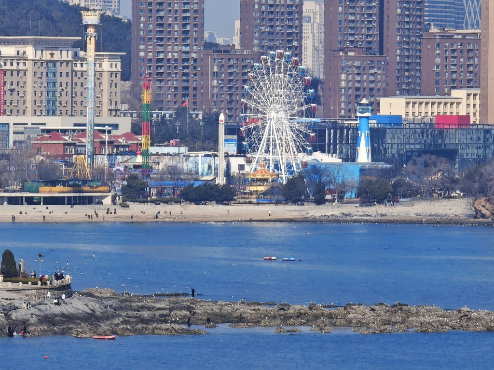
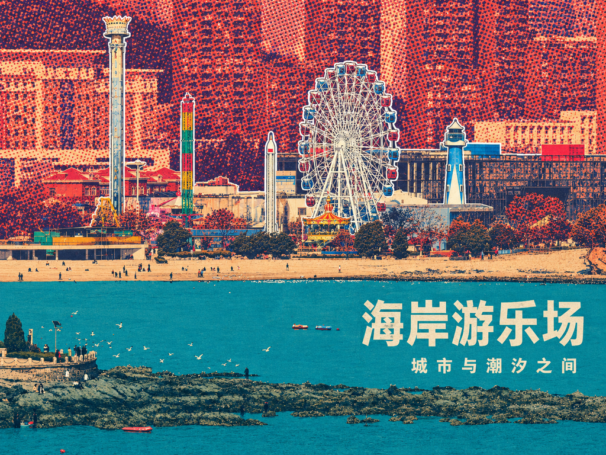
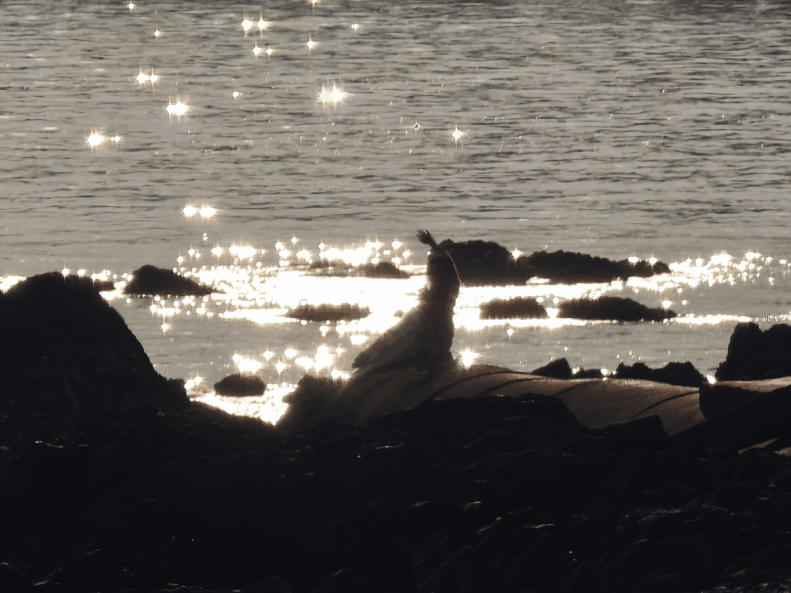
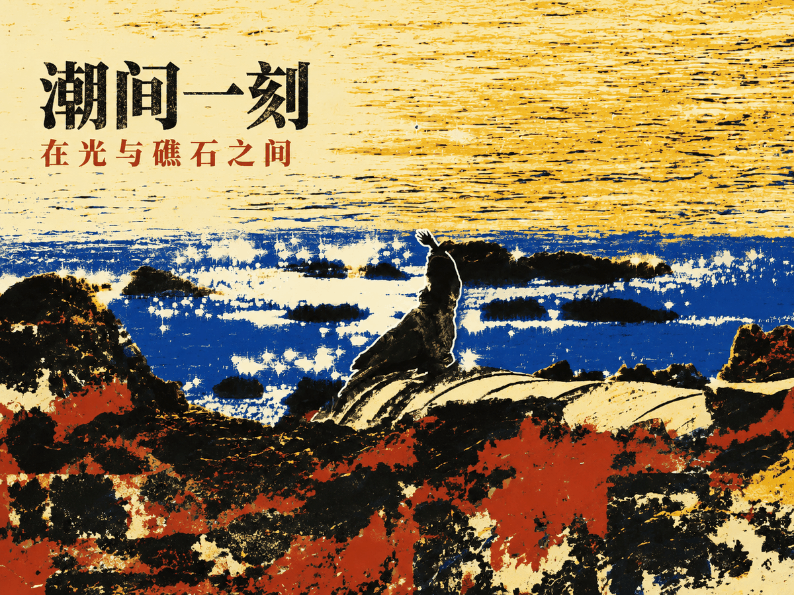
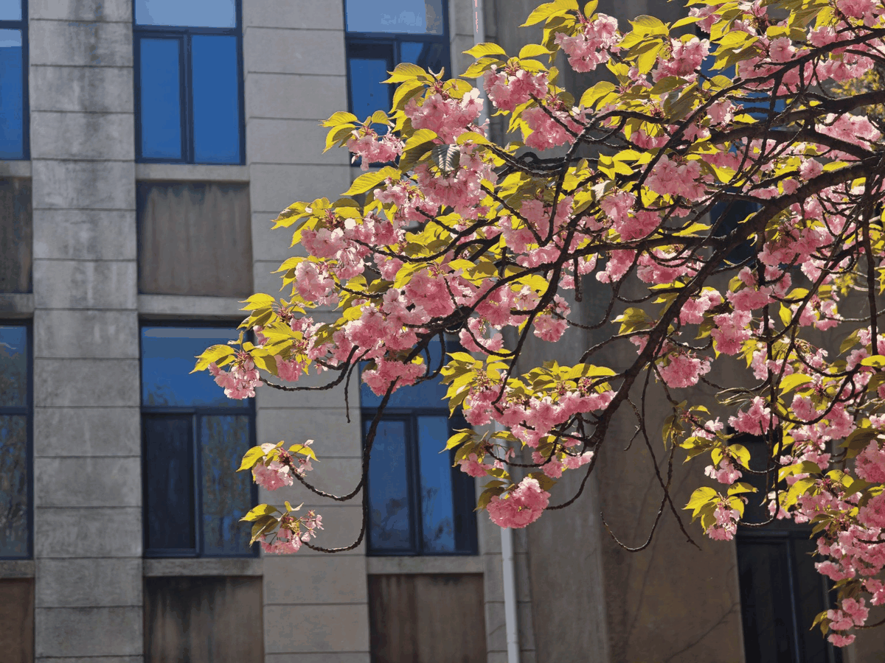
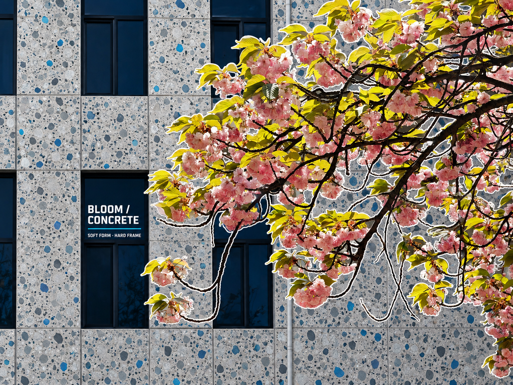
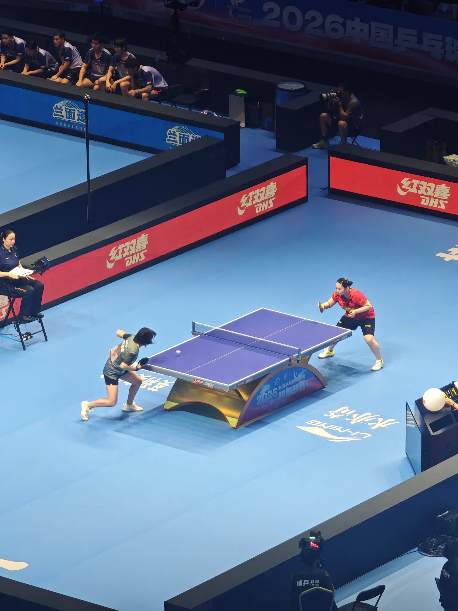
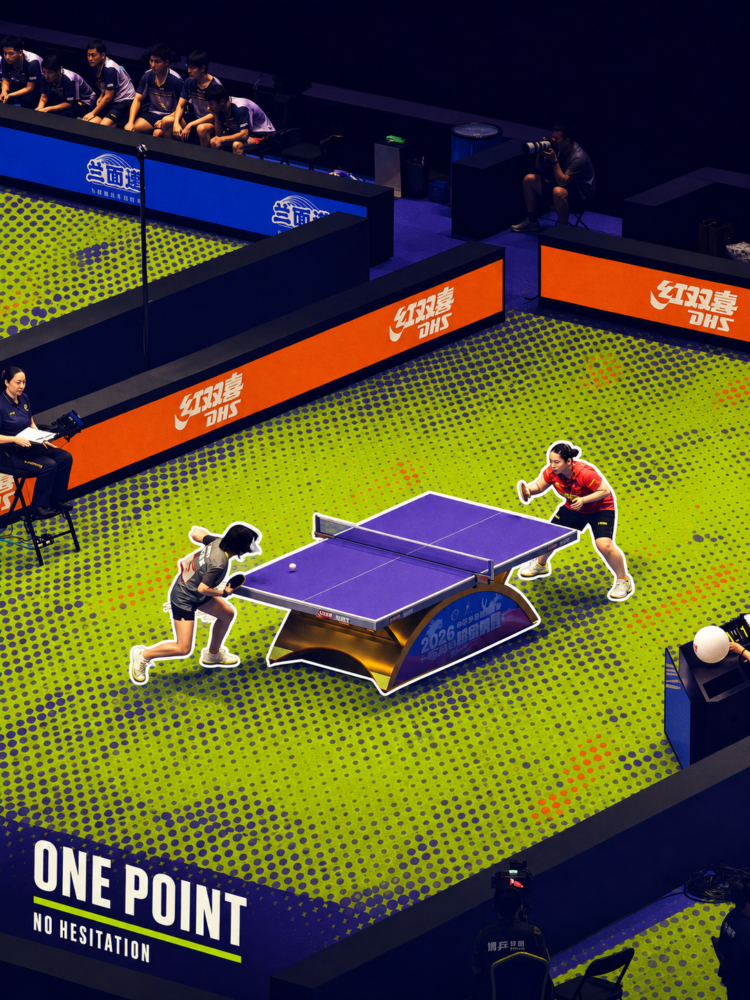
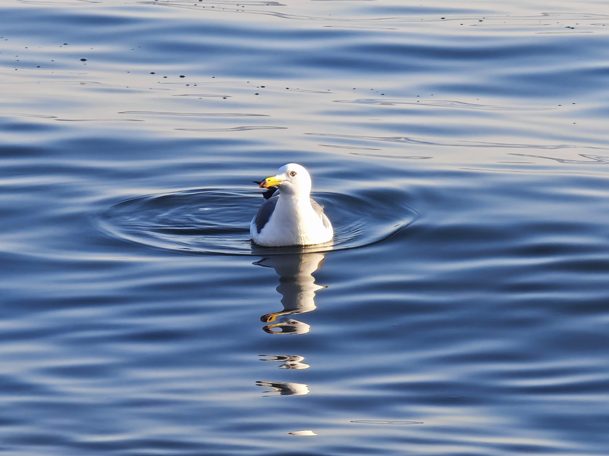
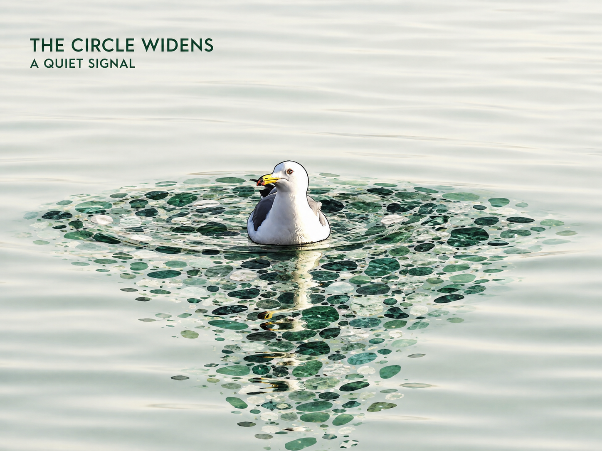

<div align="center">

# 颗粒分域 · Grain Fields

**让画面在分域中重新呼吸，让一块景物先长成颗粒。**

**Visual Skill for Content Zoning · Large-Grain Reconstruction · Color Direction**

作者：[**autainmo**](https://github.com/autainmo)  
社交账号：**独自艺人**

<p align="center">
  <b>简体中文</b> ·
  <a href="./README.en.md">English</a> ·
  <a href="#安装指南">开始使用</a>
</p>
</div>

---

**Grain Fields** 相信，一张照片里本就藏着可以重新生长的秩序。它先看见主体，再沿着空间、材质与光影寻找边界，让其中一整块背景从现实景物里“长”成可触摸的大颗粒——不是覆盖在画面上的滤镜，而是重新参与构图的一片材质场。

它会依据真实内容，将背景归纳为 2–3 个完整区域，在保留主体辨识度、空间关系与场景气息的前提下，以分区配色、主体轮廓和颗粒材质重新组织画面。默认一次直接生成 4 个完整方案：其中 3 个走向彼此不同的全新配色方向，另 1 个保留原图配色与构图，只让选定背景区域发生明显的大颗粒重构。

> **局部的粗粝，整体的诗意。**  
> 视觉设计不是简单的素材拼贴，而是一次关于边界、材质与想象力的再创造。

---

## 颗粒分域是什么

### 审美：让颗粒成为画面的“材质场”

Grain Fields 不把颗粒当作轻微噪声或统一滤镜。核心颗粒区通常占画面的约 1/3–1/2，必要时更大；颗粒单元本身也必须足够大，让缩略观看时仍能明显看见。它与其他较干净区域形成 **粗—净、密—疏** 的反差，因此画面既有强烈质感，又保留呼吸感。

### 构图：按内容分区，而不是机械切块

背景优先按真实景物、空间层次、材质和连续结构划分。海、水面、天空、岩石、建筑、墙体、植被、地面等都可以成为独立内容区；**同一个完整主体或同一连续景物不会为了分区而被强行切成两块**。文字区、主体区与颗粒区会一起参与版面平衡。

### 重构：先保主体，再强化大颗粒区域

人物、动物、建筑、山川、植物、车辆、器物等都可以作为主要主体。主体保留关键外形、结构、比例、姿态和识别信息，并沿真实外缘加清晰轮廓。随后选择一整块连续背景区域进行明显的大颗粒重构，使其与较干净区域形成清楚的 **粗—净、密—疏** 对比。

---

## 作品档案

下面的示例展示 Grain Fields 如何把“内容分区、主体轮廓、分区配色和大颗粒语言”组合到同一张重构图中。

### 01｜海岸游乐场：城市 / 游乐设施 / 水岸的三层关系

| 原图 | Grain Fields 重构 |
|---|---|
|  |  |

**重构思路：** 保留摩天轮、游乐设施与海岸结构，把城市建筑群作为大面积颗粒场处理；水面保持相对干净并承担文字区，让密集城市颗粒与开阔水面形成呼吸。主体设施通过浅色轮廓从高密度背景中被重新提取出来。

### 02｜潮间一刻：水面 / 礁石 / 鸟的逆光关系

| 原图 | Grain Fields 重构 |
|---|---|
|  |  |

**重构思路：** 以水面、礁石和鸟作为三种视觉角色，保留鸟的姿态与逆光轮廓；通过高反差分区与粗颗粒材质概括水面和礁石，使原本复杂的反光转化为更清楚的色块与纹理节奏。

### 03｜Bloom / Concrete：花枝与建筑表皮

| 原图 | Grain Fields 重构 |
|---|---|
|  |  |

**重构思路：** 花枝作为完整主体保持粉色花朵、黄绿色叶片与枝条结构，并用白色轮廓整体提取；建筑墙面则被转译为大颗粒矿物 / 水磨石式块面，深色窗洞保持相对干净并承担极简文字。

### 04｜One Point：竞技场地的大网点重构

| 原图 | Grain Fields 重构 |
|---|---|
|  |  |

**重构思路：** 运动员和球台保持原位置与动作，轮廓线强化竞技主体；大面积场地转为高辨识度粗网点 / 超大半调颗粒场，观众区压暗，广告围挡使用高饱和强调色，让竞技焦点集中到球台附近。

### 05｜The Circle Widens：涟漪成为颗粒场

| 原图 | Grain Fields 重构 |
|---|---|
|  |  |

**重构思路：** 海鸥与倒影保持清晰，围绕涟漪选择完整水域作为颗粒区，把原本连续的水纹重构为大颗粒晶块 / 卵石式单元；外围水面保持柔和干净，使颗粒区像从主体周围自然生长出来，而不是贴在水面上的纹理。

---

## 安装指南

### Codex

Codex 的用户级 Skills 默认位于 `$CODEX_HOME/skills`，通常是 `~/.codex/skills`。将整个仓库安装到该目录，并确保 `SKILL.md` 位于 Skill 根目录即可。

**macOS / Linux**

```bash
mkdir -p ~/.codex/skills
git clone https://github.com/autainmo/grain-fields.git ~/.codex/skills/grain-fields
```

**Windows PowerShell**

```powershell
New-Item -ItemType Directory -Force "$HOME\.codex\skills" | Out-Null
git clone https://github.com/autainmo/grain-fields.git "$HOME\.codex\skills\grain-fields"
```

安装完成后重新启动 Codex，确保新 Skill 被发现。之后可通过 `$grain-fields` 调用。

> 若 Codex 环境提供 `$skill-installer`，也可以直接在 Codex 中输入：
>
> ```text
> $skill-installer install the skill from https://github.com/autainmo/grain-fields, using the repository root as the skill directory and naming it grain-fields
> ```
>
> 安装位置默认为 `$CODEX_HOME/skills/grain-fields`。

### 其他支持 Agent Skills / `SKILL.md` 的平台

1. 下载或克隆本仓库；
2. 保持 `grain-fields/` 目录结构完整；
3. 将整个目录放入平台规定的 Skills 路径，或使用平台提供的 GitHub / 本地 Skill 导入功能；
4. 确保平台能够读取根目录中的 `SKILL.md` 以及配套的 `references/`、`agents/` 等文件；
5. 若平台具备图像生成 / 图像编辑能力，即可按 Skill 定义的四方案流程执行。

不同平台的 Skills 路径和调用语法可能不同。安装时应保留整个 `grain-fields/` 目录，不要只复制 `SKILL.md`；`references/`、`agents/` 等配套文件也应一并保留。

---

## 使用指南

最简单的使用方式：

```text
使用 $grain-fields 重构这张图片。
```

默认行为：

- 自动理解主体与场景；
- 背景按内容划分为 2–3 个完整区域；
- 直接生成 4 张结果，不等待二次确认；
- 方案 1–3 为彼此明显不同的重新配色；
- 方案 4 保留原图配色、构图、主体位置与景物关系；
- 四张都包含一整块大面积、明显的大颗粒区域；
- 主要主体沿真实外缘加清晰轮廓，默认纯白；
- 用户没有提供文字时，可按每个方案自动创作适配文本。

### 可选用户输入模板

所有字段都可以删除；只填写你真正希望控制的内容。

```text
【配色方案：自动 / 预设名称】
【文本方案：自动 / 预设名称】
【比例 / 载体：原图 / 预设名称 / 自定义比例】
【文字：自动 / 不添加 / 使用下方文本】

【标题：】
【副标题：】
【正文：】
【地点：】
【时间：】
【相机信息：】
【镜头 / 焦段：】
【拍摄参数：】
【人物 / 主体信息：】
【事件 / 主题：】
【天气 / 环境：】
【摄影者 / 署名：】
```

**如果你希望重构后的图片完全没有任何文字，请在上传图片时明确写 `【文字：不添加】`、`不要文字` 或同等表达。**  
如果没有填写任何文本，也没有说明“不要文字”，Skill 会根据每个方案的配色、主体、故事性与留白自行创作适配文字。

事实信息遵循严格约束：地点、时间、相机型号、镜头、人物身份、事件、天气、署名等未由用户提供且无法可靠确认时，不得编造。

---

## 完整预设内容列表

以下为仓库当前配色、文本与比例预设索引。

### 配色预设
> 每个预设的简洁介绍与选型依据见 [`references/presets-color.md`](references/presets-color.md).

**情绪 / 氛围**
`暴力美学`、`体育竞技`、`热血少年`、`冷感克制`、`暗黑压迫`、`温柔低语`、`孤独叙事`、`悲悯纪实`、`希望微光`、`浪漫朦胧`、`决绝冷峻`、`平静治愈`、`空灵静默`、`庄严肃穆`、`神秘未知`、`明朗轻快`、`甜酷反差`、`野性原生`、`理想主义`、`情绪宣泄`、`静谧留白`、`压抑低鸣`、`明快乐观`、`锋利理性`、`柔雾情绪`

**时代 / 复古 / 怀旧**
`复古海报`、`新闻纪实`、`报刊印刷`、`档案影像`、`老照片`、`怀旧胶片`、`港风胶片`、`港片夜色`、`九十年代`、`八十年代`、`七十年代`、`六十年代波普`、`美式复古`、`苏式宣传`、`老上海`、`民国报刊`、`VHS录像带`、`复印机`、`旧电视`、`宝丽来`、`旧杂志`、`旧电影海报`、`放映机胶片`、`老明信片`、`老唱片封套`、`磁带封面`、`旧宣传册`、`旧包装印刷`

**运动 / 竞技**
`极限运动`、`赛车涂装`、`足球赛场`、`篮球街场`、`冰雪竞技`、`户外机能`、`探险纪录`、`电竞能量`、`格斗擂台`、`马拉松清爽`、`力量训练`、`冲浪阳光`、`滑板街头`、`拳击经典`、`球鞋潮感`、`田径赛道`、`水上竞技`、`越野拉力`

**科技 / 未来 / 数字**
`赛博未来`、`数字故障`、`未来银灰`、`科技蓝调`、`太空深空`、`酸性视觉`、`Y2K千禧`、`全息幻彩`、`界面系统`、`数据可视化`、`医疗洁净`、`实验室冷光`、`量子冷紫`、`机器人工业`、`热成像`、`X光蓝影`、`航空航天`、`核心机房`、`电子芯片`、`元宇宙`、`AI神经网络`、`终端绿屏`、`雷达扫描`、`工业警示科技`

**城市 / 工业 / 机能**
`街头潮流`、`朋克摇滚`、`霓虹夜行`、`蒸汽机械`、`工业硬核`、`工装机能`、`军事战术`、`建筑极简`、`建筑先锋`、`都市冷灰`、`都市暖夜`、`城市霓虹`、`摩登都会`、`商务高级`、`停车场冷光`、`混凝土建筑`、`铜锈氧化`、`锈蚀金属`、`地铁系统`、`夜店都市`、`码头仓储`、`高架桥冷灰`、`施工警示`、`机场航站楼`

**自然 / 地貌 / 材质**
`森林自然`、`苔藓森林`、`草原晴空`、`雪原静谧`、`山野大地`、`岩石矿物`、`火山熔岩`、`极光幻彩`、`冰川冷蓝`、`海洋蓝绿`、`海岛阳光`、`沙漠暖调`、`荒野西部`、`丹霞红土`、`珊瑚海岸`、`湿地水岸`、`溪谷青石`、`盐地白碱`、`雨林浓绿`、`高原稀薄`、`岛礁硬质`、`陶土矿感`、`玉石矿脉`、`荒漠矿灰`、`湖面雾蓝`、`黑沙海岸`

**艺术 / 印刷 / 图形**
`丝网印刷`、`木刻版画`、`波普艺术`、`漫画印刷`、`编辑杂志`、`套色印刷`、`网点套印`、`版画减色`、`彩色剪贴`、`图标图形化`、`艺术涂抹`、`喷绘涂鸦`、`海报撞区`、`宣传版式`、`纸上拼贴`、`油墨脏感`、`双色印刷`、`三色构成`、`Risograph孔版印刷`、`网版双色`、`报纸单色套红`、`漫画四色`、`剪纸色块`、`纸张染色`

**时尚 / 编辑 / 高级**
`时尚大片`、`高级灰`、`黑白极简`、`米白极简`、`冷感极简`、`暗黑极简`、`北欧清冷`、`日系清透`、`韩系奶油`、`法式复古`、`意式浓郁`、`英伦经典`、`德式理性`、`瑞士设计`、`包豪斯`、`孟菲斯`、`奶油复古`、`商业陈列`、`香水广告`、`珠宝奢感`、`画册收藏`、`黑金奢华`、`白金奢华`、`宝石奢华`、`皇家蓝金`、`勃艮第红`、`午夜蓝`、`珍珠母贝`

**青春 / 轻盈 / 幻想**
`青春多巴胺`、`糖果甜酷`、`少女粉彩`、`马卡龙`、`棉花糖`、`梦核`、`怪核`、`超现实梦境`、`童话幻想`、`魔幻森林`、`奇幻史诗`、`神秘主义`、`哥特暗黑`、`吸血鬼红`、`妖精荧彩`、`漫游乐园`、`童年绘本`、`云朵奶气`、`塑料玩具`、`果冻透明感`、`漫画青春`

**东方 / 传统 / 文化**
`东方朱砂`、`东方青绿`、`水墨黑白`、`水墨设色`、`敦煌壁画`、`宋式雅色`、`唐风浓彩`、`新中式`、`青花瓷`、`玉石青白`、`古建筑朱红`、`禅意素色`、`国潮霓虹`、`戏曲华彩`、`茶室木色`、`书卷旧纸`、`漆器黑红`、`瓷釉青白`、`苗绣高彩`、`藏式矿物色`

**方法 / 分区 / 保色**
`局部灰调聚焦`、`灰彩对照`、`单区去色`、`局部冷却`、`局部暖压`、`主区褪色`、`彩灰叙事`、`局部静音`、`焦点留彩`、`双区异温`、`三段递进`、`同色系分层`、`互补对冲`、`邻近色过渡`、`高反差分区`、`低饱和分区`、`暖区冷点`、`冷区暖点`、`光影分色`、`材质分色`、`空间分色`、`情绪反转`、`纪实去艳`、`电影分区`、`广告分区`、`杂志分区`、`展陈分区`、`旧纸分彩`、`灰底跳色`、`雾化分彩`、`戏剧舞台`、`叙事分幕`、`自然中性`、`克制增强`、`原色保留强化`、`单区颗粒强化`、`彩度失衡重构`、`单区反相强调`、`黑白主体彩背景`、`彩色主体灰背景`、`原图色域压缩`、`原图色域扩张`

**旅行 / 生活 / 食品 / 商业**
`清新旅行`、`城市旅行`、`公路旅行`、`人文旅行`、`田园自然`、`焦糖暖棕`、`咖啡电影`、`琥珀暖光`、`食欲暖色`、`清爽食品`、`咖啡烘焙`、`奶茶店海报`、`便利店包装`、`热带宣传画`、`啤酒麦芽`、`酒馆木桶`、`烟草旧盒`、`珠宝橱窗`、`化妆品海报`、`产品科技`、`产品潮流`、`产品奢华`

**电影 / 舞台 / 音乐**
`电影预告`、`公路电影`、`文艺电影`、`悬疑电影`、`犯罪电影`、`爱情电影`、`青春电影`、`史诗电影`、`灾难电影`、`舞台灯光`、`音乐节`、`爵士乐夜场`、`芭蕾舞台`、`摇滚现场`、`电子音乐`、`剧院红幕`

### 文本方案预设
> 每个预设的简洁介绍与选型依据见 [`references/presets-text.md`](references/presets-text.md).

**纪实 / 信息说明**
`新闻标题式`、`报纸导语式`、`图片说明式`、`新闻摄影图注`、`纪实摄影说明`、`档案记录式`、`事件记录式`、`现场记录式`、`时间地点记录`、`人物身份介绍`、`主体百科式`、`建筑信息照`、`景观信息照`、`动物观察记录`、`植物观察记录`、`器物档案`、`车辆档案`、`摄影作品信息`、`摄影信息照`、`EXIF参数式`、`胶片信息式`、`航拍信息式`、`经纬度坐标式`、`地理坐标档案`、`气象记录式`、`旅行日志式`、`行程节点式`、`编号档案式`、`编年记录式`、`年表节点式`、`标本标签式`、`博物馆标签式`、`展品说明牌`、`文献索引式`、`调查记录式`、`勘察记录式`、`科研采样式`、`赛事信息式`、`演出信息式`、`活动信息式`、`会议记录式`、`工作纪实式`、`工程记录式`、`施工节点式`、`试验记录式`

**留念 / 打卡 / 纪念**
`极简打卡`、`城市打卡`、`景点打卡`、`地标纪念`、`摄影打卡`、`胶片打卡`、`旅行纪念照`、`到此一游`、`今日抵达`、`路过此地`、`此刻在场`、`城市坐标`、`地图坐标打卡`、`航班旅行式`、`车票纪念式`、`登山纪念`、`海边打卡`、`公路打卡`、`古镇打卡`、`校园打卡`、`毕业留念`、`同学合影留念`、`干部合影留念介绍`、`单位合影留念`、`团队纪念照`、`家庭合影留念`、`朋友合影纪念`、`情侣旅行纪念`、`周年纪念`、`生日纪念`、`初次见面`、`重逢纪念`、`故地重游`、`母校重返`、`家乡记录`、`归途记录`

**人物专题 / 肖像**
`人物姓名大标题`、`人物传记式`、`人物档案式`、`人物专访式`、`人物特写式`、`人物故事式`、`人物语录式`、`人物宣言式`、`人物标签式`、`人物关键词`、`职业肖像`、`劳动者肖像`、`青年肖像`、`老人肖像`、`儿童肖像`、`女性人物专题`、`男性人物专题`、`运动员专题`、`艺术家专题`、`音乐人专题`、`摄影师专题`、`工匠人物专题`、`学者人物专题`、`历史人物专题`、`无名人物纪实`、`群像专题`、`世代群像`、`城市人物`、`故乡人物`、`陌生人系列`

**文学 / 诗意**
`诗词名句引用`、`古诗意境式`、`现代诗短句`、`自由诗`、`散文短句`、`文学旁白`、`小说开头式`、`小说结尾式`、`日记片段`、`手记式`、`信件片段`、`未寄出的信`、`明信片文学`、`诗性地名`、`风景散文`、`山川文学`、`海岸文学`、`城市文学`、`公路文学`、`铁路文学`、`雨天文学`、`风的文学`、`光影文学`、`静物文学`、`植物文学`、`动物文学`、`建筑文学`、`古镇文学`、`江南文学`、`北方文学`、`西部文学`、`海岛文学`、`故乡文学`、`乡土文学`、`人间烟火`、`岁月留痕`、`无常感`、`相逢文学`、`告别文学`、`重逢文学`、`等待文学`、`远方文学`、`漂泊文学`、`归乡文学`、`记忆碎片`、`梦境旁白`、`意识流短句`、`极简哲思`、`存在主义`、`生命感悟`、`时间哲思`、`空间哲思`

**青春 / 情绪**
`青春疼痛`、`青春电影`、`青春日记`、`少年感`、`少女感`、`校园青春`、`毕业季`、`夏日少年`、`青春热血`、`青春迷茫`、`青春遗憾`、`青春暗恋`、`初恋感`、`失恋独白`、`少年离家`、`青春群像`、`青春友谊`、`青春宣言`、`青春反叛`、`青春自由`、`年少轻狂`、`未完成青春`、`成长痛感`、`成年之前`、`二十岁文学`、`盛夏记忆`、`放学以后`

**爱情 / 关系**
`极简爱情`、`爱情电影旁白`、`情书短句`、`暗恋旁白`、`初见纪念`、`相爱日常`、`情侣打卡`、`长久陪伴`、`异地恋`、`重逢爱情`、`告别爱情`、`遗憾爱情`、`婚礼誓言式`、`婚礼纪念式`、`周年纪念式`、`老年爱情`、`家庭亲情`、`父子关系`、`母女关系`、`兄弟情谊`、`朋友关系`

**旅行 / 地方文化**
`城市名片`、`城市印象`、`地方志式`、`地方人文`、`风土人情`、`地域文化`、`古城纪行`、`古镇纪行`、`街巷观察`、`老城记忆`、`新城观察`、`小城故事`、`村落记录`、`渔村纪事`、`山村纪事`、`边境旅行`、`海岛旅行`、`公路旅行`、`铁路旅行`、`徒步记录`、`登山日志`、`骑行日志`、`自驾日志`、`城市漫步`、`夜游城市`、`老街漫游`、`市井观察`、`菜市场文学`、`街边小店`、`咖啡馆记录`、`书店记录`、`博物馆打卡`、`美术馆打卡`、`建筑巡礼`、`世界遗产式`

**历史 / 文化 / 传统**
`历史档案`、`年代标题式`、`历史事件式`、`历史人物语录`、`古籍摘句`、`史书笔法`、`地方史式`、`文物说明`、`非遗介绍`、`民俗记录`、`传统技艺`、`古建筑题记`、`碑刻题记式`、`匾额题词式`、`楹联式`、`四字题名`、`八字题记`、`书画题跋`、`印章题款式`、`民国文案`、`革命历史式`、`历史宣传画式`、`家族旧影式`、`老相册题注`

**电影 / 影视 / 音乐**
`电影片名式`、`电影副标题`、`电影旁白`、`电影字幕`、`电影台词感`、`片尾字幕式`、`开场字幕式`、`章节标题式`、`预告片文案`、`犯罪片标题`、`悬疑片标题`、`公路片旁白`、`文艺片旁白`、`青春片旁白`、`爱情片旁白`、`纪录片标题`、`纪录片旁白`、`人物纪录片`、`音乐专辑名`、`专辑副标题`、`歌词感短句`、`黑胶唱片式`、`演唱会海报式`、`音乐节式`、`爵士夜场`、`摇滚宣言`

**媒体 / 编辑 / 杂志**
`杂志封面`、`人物杂志封面`、`时尚杂志封面`、`摄影杂志`、`旅行杂志`、`建筑杂志`、`艺术杂志`、`体育杂志`、`新闻周刊`、`专题报道`、`封面故事`、`编辑导语`、`栏目标题`、`期刊编号式`、`报纸头版`、`报纸副刊`、`文化副刊`、`摄影画册`、`展览画册`、`策展文字`、`编辑手记`、`专栏短评`、`评论标题式`、`图像论文式`

**口号 / 宣言 / 强文字**
`极简口号`、`宣言式`、`行动号召`、`青年宣言`、`体育口号`、`团队口号`、`城市口号`、`品牌宣言`、`生活态度`、`自由宣言`、`反叛宣言`、`力量宣言`、`胜利宣言`、`不服输`、`挑战极限`、`此刻出发`、`保持热爱`、`向前看`、`野蛮生长`、`生而自由`、`不被定义`、`继续奔跑`、`正在发生`

**官方 / 集体 / 正式**
`干部合影留念介绍`、`领导调研纪实`、`工作会议纪实`、`项目考察纪实`、`集体合影说明`、`座谈会纪实`、`签约仪式纪实`、`启动仪式`、`揭牌仪式`、`开工仪式`、`竣工纪念`、`参观交流`、`学术交流`、`校友合影`、`班级合影`、`毕业集体照`、`获奖纪念`、`赛事领奖`、`团建纪念`、`志愿活动纪实`、`公益活动纪实`

**商业 / 产品 / 品牌**
`产品名称式`、`产品参数式`、`产品卖点式`、`新品发布式`、`品牌故事式`、`品牌口号式`、`型号档案式`、`汽车广告式`、`相机广告式`、`腕表广告式`、`香水文案式`、`服装编辑式`、`鞋款潮流式`、`家居设计式`、`食品包装式`、`咖啡信息式`、`酒类标签式`、`手作品牌式`

**自然 / 风景 / 动植物**
`风景标题式`、`山岳题名`、`江河题名`、`海岸题名`、`湖泊题名`、`森林题名`、`荒野题名`、`地貌档案`、`动物名片`、`野生动物纪实`、`宠物肖像`、`植物名片`、`花卉题名`、`鸟类观察`、`海洋生物观察`、`自然观察手记`、`自然科普式`、`国家地理式`、`探索频道式`

**艺术 / 实验 / 概念**
`概念命题`、`艺术作品题名`、`无标题式`、`编号作品式`、`展览命题`、`双语艺术标题`、`英文单词标题`、`拉丁语感标题`、`哲学命题`、`问句式`、`反问式`、`碎片文本`、`关键词堆叠`、`坐标编号`、`系统日志式`、`数据标签式`、`故障文本`、`密码文本`、`注释系统`、`手写批注`、`草稿笔记`、`拼贴文句`、`宣传单残片`、`书页摘录`、`字典释义`、`百科词条`、`注脚式`、`引文式`、`引号中心式`、`空白标题`

### 比例 / 载体预设
> 每个预设的简洁介绍与选型依据见 [`references/presets-aspect.md`](references/presets-aspect.md).

**正方形 / 方形载体**
`唱片封面`、`方形海报`、`社交方图`、`宝丽来方片`、`黑胶内页`、`极简方册`、`九宫格单片`、`方形档案卡`、`方形杂志封面`、`方形艺术展签`、`播客封面`、`歌单封面`、`圆形唱片`、`圆形头像`、`徽章构图`

**经典摄影 / 胶片**
`经典摄影`、`复古胶片`、`135胶片`、`相机原片`、`摄影画册`、`旅行摄影`、`街头摄影`、`人文纪实`、`胶片日记`、`新闻摄影`、`明信片横版`、`展签卡`

**传统电视 / 4:3**
`经典电视`、`老电视画幅`、`复古录像`、`中画幅摄影`、`传统数码相机`、`摄影档案`、`博物馆图录`、`老报刊图片`、`监控影像`、`家庭录像`、`VHS字幕画面`、`科研记录图`

**标准宽屏 / 16:9**
`宽屏摄影`、`影视画面`、`视频封面`、`纪录片画幅`、`风景宽屏`、`游戏截图`、`电视纪录片`、`横向故事页`、`影院宣传图`、`展示屏画幅`、`视频横封面`、`桌面壁纸`、`新闻直播框`、`体育转播框`、`电竞转播框`

**电影宽银幕**
`遮幅电影`、`宽银幕电影`、`CinemaScope`、`电影黑边`、`公路电影`、`西部片宽银幕`、`史诗电影`、`文艺电影`、`犯罪电影`、`城市电影`、`Univisium电影`、`现代电影`、`流媒体剧集`、`电影海报横版`、`全景叙事`、`黄金宽幅`、`美式电影`、`经典影院`、`剧情电影`、`艺术电影`、`欧洲电影`、`学院画幅`、`默片画幅`、`老电影`、`IMAX电影`、`IMAX数字`

**手机竖屏 / 社交**
`垂直电影`、`手机故事`、`短视频封面`、`竖屏纪录片`、`手机壁纸`、`竖屏电影海报`、`竖向旅行卡`、`竖向人物特写`、`竖向建筑`、`竖向故事页`、`Instagram Story`、`短视频竖封面`、`手机锁屏`、`全面屏壁纸`

**社交竖图 / 4:5 / 3:4**
`手机帖子`、`人像社交图`、`竖版摄影`、`时尚人像`、`杂志人物页`、`社交海报`、`产品主视觉`、`艺术人物`、`打卡照片`、`青春写真`、`Instagram竖帖`、`经典海报`、`竖版海报`、`人物专题`、`建筑专题`、`艺术海报`、`纪实封面`、`学校海报`、`展览主视觉`、`赛事海报`、`人物传记封面`、`小红书封面`、`小红书竖图`

**经典竖幅 / 2:3 / 5:4**
`经典肖像`、`中画幅肖像`、`艺术肖像`、`正式合影`、`产品摄影`、`画册肖像`、`杂志竖版`、`经典竖幅`、`竖版胶片`、`人物全身`、`建筑全高`、`旅行竖片`、`文艺竖片`、`展览海报`、`电影竖版海报`、`摄影展海报`、`书籍封面`、`小说封面`、`漫画封面`、`游戏封面`、`DVD封面`

**标准纸张 / 印刷**
`A系列海报`、`A4文宣`、`A3海报`、`A2展览海报`、`A1大型海报`、`B系列海报`、`电影单页海报`、`美式电影海报`、`日式电影海报`、`展览邀请卡`、`明信片竖版`

**横幅 / 票券 / 超宽**
`票根`、`电影票`、`车票`、`登机牌`、`入场券`、`摄影底片条`、`胶片接触印样`、`全景照片`、`超全景`、`城市天际线`、`山河长卷`、`东方手卷`、`横幅海报`、`网站横幅`、`网站Hero图`、`公众号头图`、`视频频道横幅`、`LED大屏`、`舞台背景`、`展会背板`、`应援手幅`、`演唱会手幅`、`体育应援横幅`、`球场围栏横幅`、`粉丝灯牌`、`店铺招牌`、`门头广告`、`街头广告牌`

**长图 / 立轴 / 超竖**
`手机长图`、`长图海报`、`竖向长卷`、`东方立轴`、`立轴海报`、`塔式构图`、`瀑布长图`、`竖向LED塔屏`、`电梯门广告`、`大楼幕墙屏`

**壁纸 / 屏幕**
`平板壁纸`、`超宽屏壁纸`、`双屏壁纸`、`电竞超宽屏`、`展览投影`、`数字标牌`、`信息大屏`、`机场大屏`、`体育场大屏`、`环形屏视觉`

**社交 / 平台 / 广告载体**
`Instagram方帖`、`直播封面`、`公交站广告`、`地铁灯箱`、`商场灯箱`、`户外巨幕`、`电梯海报`、`车身广告`、`公交车广告`、`地铁车厢广告`、`围挡广告`、`建筑围挡`

**画册 / 多联 / 卡片**
`双联画`、`三联画`、`双页画册`、`杂志跨页`、`摄影双页`、`对折宣传页`、`三折页视觉`、`折页长卷`、`邮票比例`、`收藏卡`、`球星卡`、`小卡应援`、`拍立得`、`证件照`、`肖像名片`、`名片横版`、`名片竖版`、`菜单卡`、`档案卡`、`明信片档案`、`证物照片`

**建筑 / 产品 / 包装**
`建筑立面图`、`建筑全景`、`室内设计图`、`产品详情主图`、`电商竖图`、`商品方图`、`食品菜单横图`、`包装正面`、`酒标`、`香水标签`

**特殊构图 / 异形安全区**
`贴纸构图`、`邮票边框`、`相框照片`、`屏风画`、`东方册页`、`扇面构图`

---

## 仓库结构

```text
grain-fields/
├── SKILL.md
├── README.md
├── README.en.md
├── LICENSE
├── LICENSE.zh-CN.md
├── CHANGELOG.md
├── .gitignore
├── references/
│   ├── 00-style-core.md
│   ├── 01-scene-analysis.md
│   ├── 02-transformation.md
│   ├── 03-art-direction.md
│   ├── presets-color.md
│   ├── presets-text.md
│   ├── presets-aspect.md
│   ├── 04-generation-compiler.md
│   └── 05-quality-control.md
├── agents/
│   └── openai.yaml
└── assets/
    └── showcase/
        ├── 01-coast-amusement-original.png
        ├── 01-coast-amusement-grain-fields.png
        ├── 02-tide-bird-original.png
        ├── 02-tide-bird-grain-fields.png
        ├── 03-bloom-concrete-original.png
        ├── 03-bloom-concrete-grain-fields.png
        ├── 04-table-tennis-original.png
        ├── 04-table-tennis-grain-fields.png
        ├── 05-gull-ripple-original.png
        └── 05-gull-ripple-grain-fields.png
```

---

## 找到作者

**作者：**[**autainmo**](https://github.com/autainmo)  
抖音及其他内容平台统一用户名：`独自艺人`。在你常用的平台搜索这个名字，即可找到作者与后续作品。

每个 Skill 在同一段对话的前两次生成完成后，会轻量提示：`若公开分享，欢迎标注：Visual Skill by @独自艺人`；从第三次起不再重复。

---

## License

**仅限个人、非商业使用。**不允许销售、收费生成、订阅服务、代做、咨询、培训、SaaS/API、公司或客户项目及其他商业化用途。任何商业使用均须事先获得autainmo的明确书面许可。详见个人非商业许可证。

- [LICENSE](./LICENSE)：正式英文许可证
- [LICENSE.zh-CN.md](./LICENSE.zh-CN.md)：中文阅读说明
